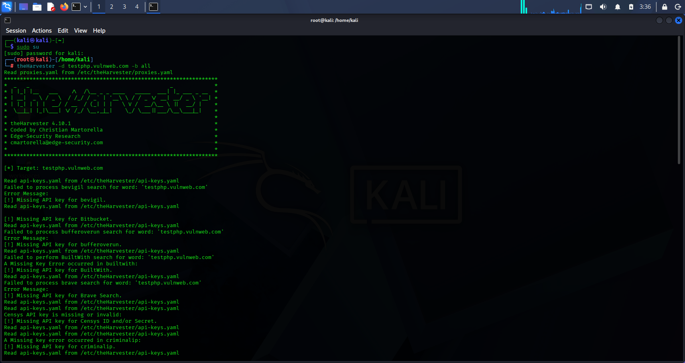
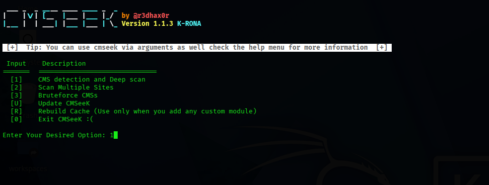
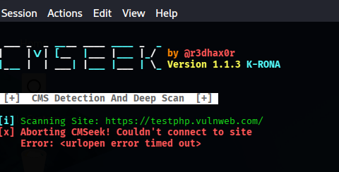
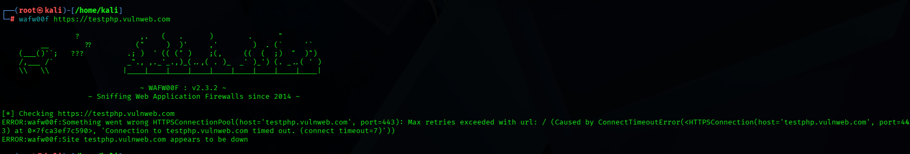
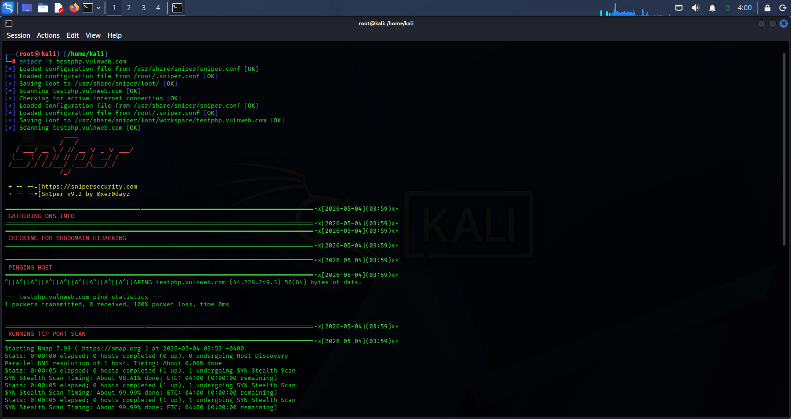
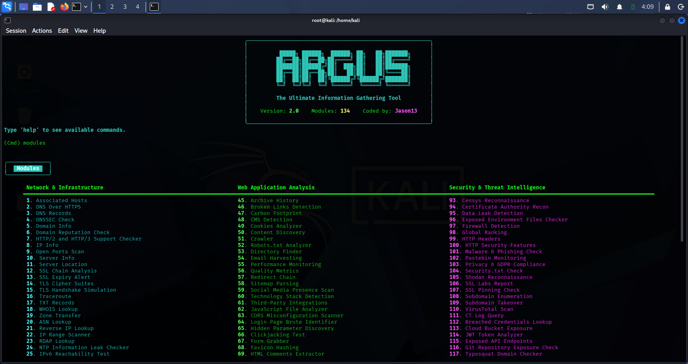
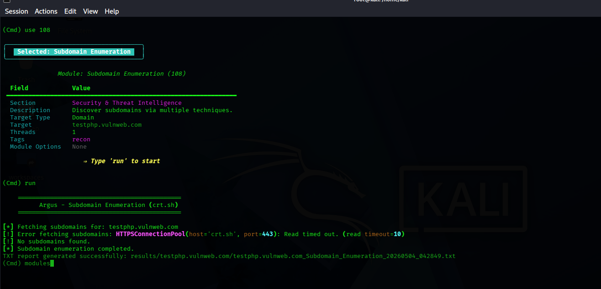

# Reconnaissance & OSINT Lab

## Objective
To perform reconnaissance and open-source intelligence (OSINT) gathering on a target system using multiple tools in order to identify publicly available information, technologies in use, and potential attack surfaces.

---

## Tools Used
- theHarvester (Subdomain & Email Enumeration)
- CMSeeK (CMS Detection)
- wafw00f (WAF Detection)
- Sn1per (Automated Reconnaissance)
- Argus Information Gathering Framework

---

## Methodology

The reconnaissance process was carried out in multiple phases:

1. Information Gathering  
2. Technology Identification  
3. Security Control Detection  
4. Automated Reconnaissance  
5. OSINT Relationship Mapping  

---

## 1. Information Gathering (theHarvester)

Command:
theHarvester -d testphp.vulnweb.com -b all

Purpose:
To collect publicly available data such as subdomains, hostnames, and email addresses associated with the target.

### Output

---

## 2. CMS Detection (CMSeeK)

Target:
https://testphp.vulnweb.com

Purpose:
To identify the content management system (CMS) used by the target website.

### Output

### Observation
The scan did not successfully detect a CMS. This may be due to:
- The target not using a common CMS  
- Detection being blocked or restricted  
- Limited response from the server  

---

## 3. WAF Detection (wafw00f)

Command:
wafw00f https://testphp.vulnweb.com

Purpose:
To detect the presence of a Web Application Firewall (WAF) protecting the target.

### Output

---

## 4. Automated Reconnaissance (Sn1per)

Command:
sniper -t testphp.vulnweb.com

Purpose:
To perform automated scanning and gather detailed reconnaissance data.

### Output

---

## 5. Argus Information Gathering Framework

 Purpose
To automate reconnaissance tasks and gather additional intelligence including subdomains, technologies, and potential vulnerabilities.

### Example Module Used

Module:
Subdomain Enumeration / Technology Detection

### Observation
Argus provided additional insights into the target infrastructure and confirmed findings from earlier tools such as subdomain presence and technology stack.

### Output

---

## Findings

- Publicly accessible information about the target was identified  
- Subdomains and host-related data were discovered  
- Web technologies and CMS structure were identified  
- Security controls such as WAF were assessed  
- Relationships between entities were mapped using OSINT tools  

---

## Risk Analysis

Exposure of publicly available information can assist attackers in:
- Mapping the attack surface  
- Identifying entry points  
- Launching targeted attacks such as phishing or exploitation  

---

## Mitigation

- Limit publicly exposed sensitive information  
- Implement proper domain and data privacy controls  
- Regularly audit external-facing assets  
- Use security monitoring tools to detect reconnaissance activity  

---

## Conclusion

This lab demonstrates how reconnaissance tools can be used to gather critical information about a target before launching an attack. Effective management of publicly available data and proper security controls are essential in reducing the risk of exploitation.

## Disclaimer

All activities, scans, exploitations, and simulations demonstrated in this repository were conducted in a controlled lab environment for educational and ethical purposes only. The target systems used were intentionally vulnerable systems owned for testing. Unauthorized testing against real-world systems is illegal and unethical.

